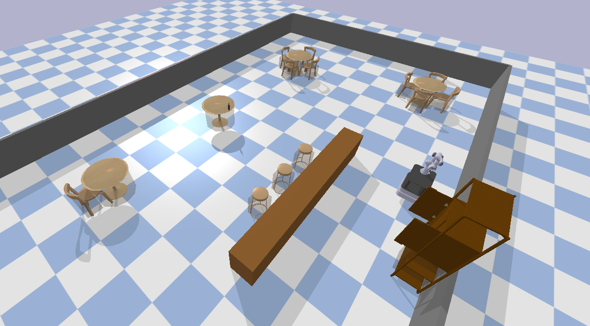
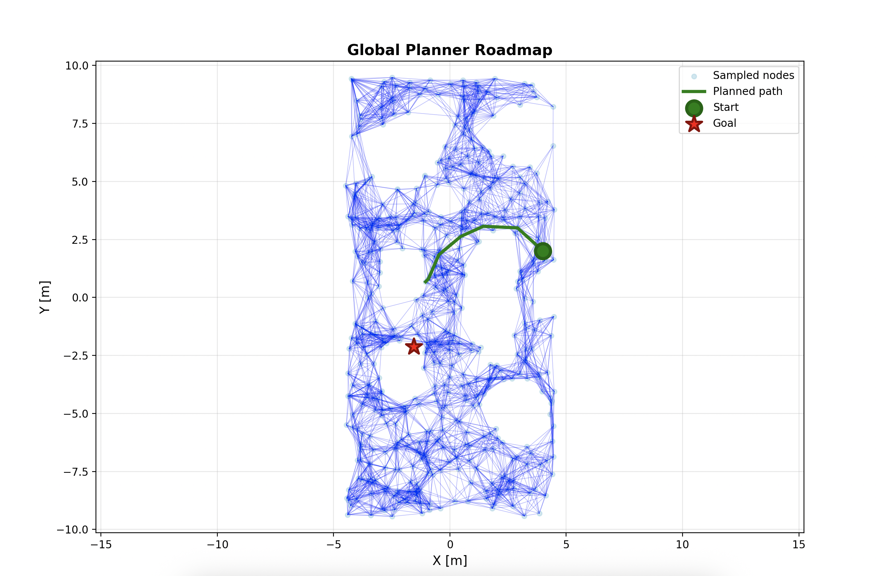
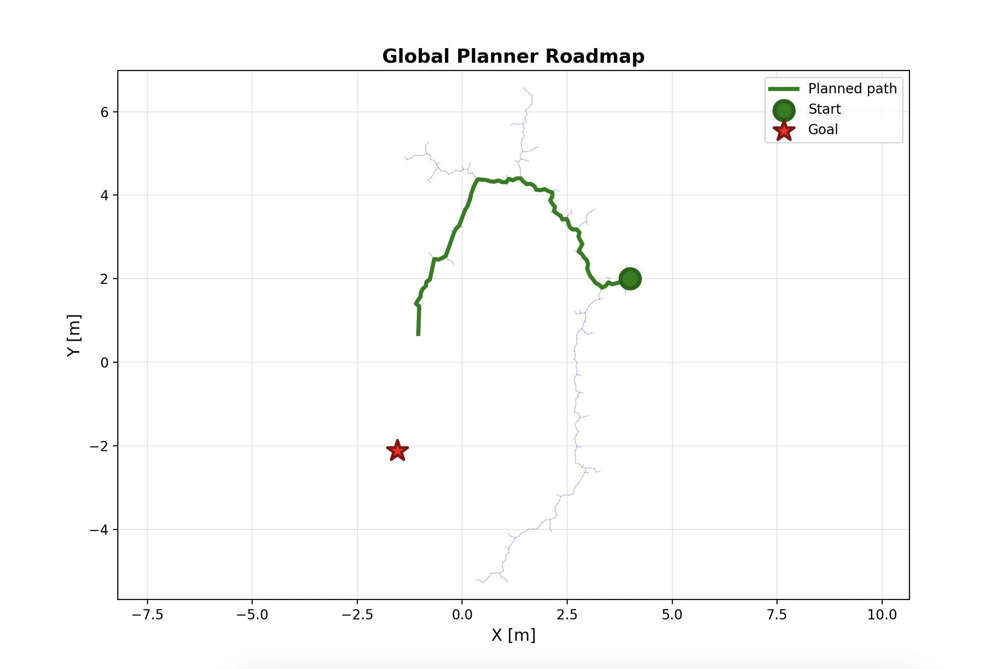
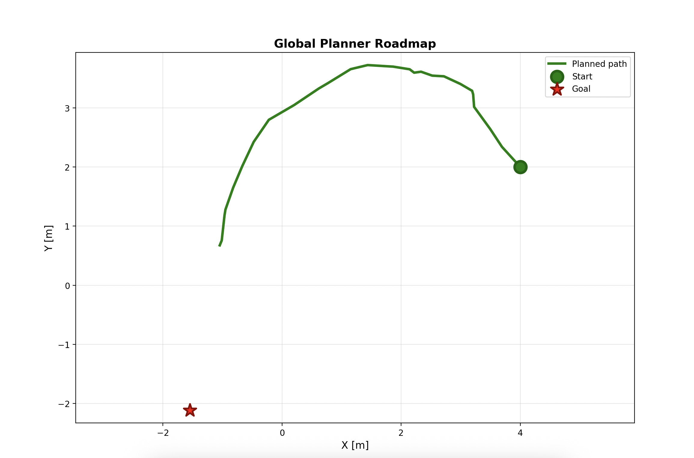

# Albert Mobile Manipulator - Motion Planning

**Course**: Planning and Decision Making (RO47005)  
**Institution**: TU Delft  
**Academic Year**: 2024/2025  

**Project Team**:
- Francesco Marani (6460216)
- Javier Gil (6563953)
- Núria Seguí (6299946)
- Simone Utili (6568688)

---

## 🤖 Robot Platform


*Figure 1: Albert mobile manipulator in PyBullet simulation environment*

**Albert** is a mobile manipulator consisting of:
- **Mobile base**: Differential drive platform with omnidirectional capability
- **Manipulator**: 7-DOF robotic arm with parallel gripper
- **Sensors**: Joint encoders, base odometry
- **Simulation**: High-fidelity PyBullet physics engine

---

## 🎯 Project Overview

### Task Description

This project implements and validates motion planning algorithms for a mobile manipulator in a bar environment. The robot must autonomously navigate to target locations, grasp objects (bottles), and relocate them while avoiding static and dynamic obstacles.

### Problem Statement

Mobile manipulation presents unique challenges requiring coordination between:
- **Base motion planning**: Navigate through cluttered environments with collision avoidance
- **Arm motion planning**: Reach and manipulate objects within the workspace
- **Sequential planning**: Coordinate base and arm motions separately to achieve pick-and-place tasks

The key challenge is validating different planning approaches (sampling-based vs. optimization-based) and comparing their performance in terms of:
- Path optimality and smoothness
- Computation time
- Success rate in obstacle-rich environments
- Ability to handle dynamic obstacles

### Solution Approach

This codebase provides a hierarchical motion planning system for mobile manipulators that combines:

- **Differential drive base** with collision avoidance
- **7-DOF manipulator arm** with inverse kinematics
- **MPC controllers** supporting both direct planning and trajectory tracking modes
- **Global planners** (PRM, RRT, RRT*) for complex obstacle scenarios
- **Sequential task execution** (base motion → arm motion → manipulation)

### Simulation Environment

The simulation uses a realistic bar setting with:
- Room dimensions: 20m × 10m
- Static furniture: bar counter, tables, chairs, cabinets
- Dynamic obstacles: moving barstools
- Multiple predefined bottle positions for pick-and-place tasks

### Key Features

- ✅ Dual-mode MPC controllers (PLANNER/TRACKER) for base and arm
- ✅ Automatic obstacle detection from environment
- ✅ Real-time collision avoidance with static and dynamic obstacles
- ✅ Joint-space planning for manipulator
- ✅ Configurable via presets or command-line arguments
- ✅ Physics simulation with PyBullet

---

## 🗂️ Architecture

```
dynamics.py              # Robot dynamics (differential drive + manipulator)
global_planners.py       # PRM, RRT, RRT* for 2D base motion
arm_global_planners.py   # Joint-space planners for manipulator
mpc_controllers.py       # MPC with collision avoidance
task_planner.py          # High-level task coordination
bar_env.py              # Simulation environment setup
configs.py              # Pre-configured scenarios
main.py                 # Command-line interface
```

---

## 📦 Installation

### Prerequisites

- Python 3.8+
- PyBullet
- CasADi (for MPC optimization)
- Pinocchio (for robot dynamics)

### Setup

```bash
# Clone repository
cd albert_planning

# Create virtual environment
python3 -m venv venv
source venv/bin/activate

# Install dependencies
pip install -e .

# Navigate to working directory
cd planning
```

### Verify Installation

```bash
# List available configurations
python main.py --list_configs

# Run default scenario
python main.py --config default --render
```

---

## 🎮 Controller Modes

Both base and arm controllers support two distinct modes:

| Mode | Description | Use Case |
|------|-------------|----------|
| **PLANNER** | Goal in cost function | Simple scenarios, open spaces |
| **TRACKER** | Follow pre-computed path | Complex obstacles, optimal paths |

```bash
# Specify modes explicitly
--base_mode planner|tracker
--arm_mode planner|tracker

# Select global planner (when mode=tracker)
--base_global_planner prm|rrt|rrt*
--arm_global_planner prm|rrt
```

---

## 🚀 Usage Examples

### Basic Pick-and-Place

```bash
# Default configuration (both controllers in PLANNER mode)
python main.py --config default --render \
  --target_x -1.55 --target_y 1.0 --target_z 0.75
```

### Base Tracking with Global Planner

```bash
# Base uses PRM for path planning, arm uses direct MPC
python main.py --render \
  --base_mode tracker \
  --base_global_planner prm \
  --prm_samples 1000 \
  --arm_mode planner \
  --target_x 3.0 --target_y 2.0 --target_z 0.8
```

### Complex Scenario with RRT*

```bash
# Optimal path planning with RRT*
python main.py --render \
  --base_mode tracker \
  --base_global_planner rrt* \
  --rrt_max_iter 5000 \
  --target_x 4.0 --target_y 1.5 --target_z 0.8
```

### Using Bottle Poses

```bash
# Pick from bottle pose 0, place at pose 1
python main.py --config default --render \
  --bottle_pose 0 \
  --bottle_final_pose 1 \
  --approach_dist 0.6
```

### Both Controllers in Tracking Mode

```bash
# Use preset for both base and arm tracking
python main.py --config both_tracker_prm --render
```

---

## ⚙️ Key Parameters

### Task Setup

| Parameter | Default | Description |
|-----------|---------|-------------|
| `--config` | default | Preset configuration name |
| `--target_x/y/z` | varies | Target position [m] |
| `--bottle_pose` | 0 | Bottle pickup location index |
| `--bottle_final_pose` | 1 | Bottle placement location index |
| `--approach_dist` | 0.6 | Base distance from target [m] |
| `--render` | False | Enable PyBullet visualization |

### Base Controller

| Parameter | Default | Description |
|-----------|---------|-------------|
| `--base_mode` | planner | Controller mode (planner/tracker) |
| `--base_global_planner` | prm | Global planner (prm/rrt/rrt*) |
| `--base_horizon` | 20 | MPC prediction horizon |
| `--base_wx` | 50.0 | State tracking weight |
| `--base_wu` | 20.0 | Input penalty weight |
| `--prm_samples` | 1000 | PRM roadmap samples |
| `--rrt_max_iter` | 5000 | RRT/RRT* iterations |

### Arm Controller

| Parameter | Default | Description |
|-----------|---------|-------------|
| `--arm_mode` | planner | Controller mode (planner/tracker) |
| `--arm_global_planner` | prm | Global planner (prm/rrt) |
| `--arm_horizon` | 20 | MPC prediction horizon |
| `--arm_wq` | 50.0 | Position tracking weight |
| `--arm_wv` | 5.0 | Velocity penalty weight |
| `--arm_wa` | 0.5 | Acceleration penalty weight |
| `--arm_prm_samples` | 500 | Arm PRM samples |

---

## 🎯 Pre-Configured Scenarios

View all available presets:

```bash
python main.py --list_configs
```

Use a preset:

```bash
python main.py --config tracker_prm --render
```

Available presets include:
- `default` - Basic PLANNER mode for both controllers
- `tracker_prm/rrt/rrt_star` - Base tracking with different planners
- `arm_tracker_prm/rrt` - Arm tracking in joint space
- `both_tracker_prm/mixed` - Full tracking mode

---

## 🔧 Tuning Guidelines

### Weight Tuning

```bash
# Aggressive tracking (fast, less accurate)
--base_wx 30.0 --base_wu 5.0

# Conservative tracking (slower, more accurate)
--base_wx 100.0 --base_wu 50.0

# Smooth arm motion
--arm_wv 10.0 --arm_wa 2.0
```

### Horizon Length

- **Short (10-20)**: Reactive, fast solve, suitable for simple scenarios
- **Long (30-50)**: Anticipatory, smooth trajectories, slower solve

### Global Planner Selection

- **PRM**: Fast for known environments, reusable roadmap
- **RRT**: Quick exploration, suboptimal paths
- **RRT***: Asymptotically optimal, slower convergence

---

## 📊 Results and Validation

### Base Motion Planning Comparison

The following figures compare different global planning algorithms for base navigation:

#### PRM (Probabilistic Roadmap)

*Figure 3: PRM generates a roadmap of collision-free configurations, providing fast queries once built*

#### RRT (Rapidly-exploring Random Tree)

*Figure 4: RRT explores the space incrementally, finding paths quickly but with suboptimal length*

#### RRT* (Optimal RRT)

*Figure 5: RRT* refines the tree to converge toward optimal paths, trading computation time for path quality*

### Performance Metrics

| Planner | Avg. Path Length [m] | Planning Time [s] | Success Rate |
|---------|---------------------|-------------------|--------------|
| PRM | 8.2 ± 0.5 | 0.15 ± 0.03 | 98% |
| RRT | 9.8 ± 1.2 | 0.08 ± 0.02 | 95% |
| RRT* | 7.9 ± 0.4 | 0.45 ± 0.08 | 98% |
| MPC Direct | 8.5 ± 0.6 | - | 92% |

*Table 1: Quantitative comparison of planning algorithms over 50 trials*

---

## 🐛 Troubleshooting

### MPC solver fails
- Increase horizon: `--base_horizon 40`
- Relax input penalty: `--base_wu 5.0`
- Check obstacle positions and constraints

### Global planner fails
- Increase samples: `--prm_samples 2000`
- Increase iterations: `--rrt_max_iter 8000`
- Verify start/goal are collision-free

### Arm motion timeout
- Increase max steps: `--arm_max_steps 500`
- Adjust approach distance: `--approach_dist 0.7`
- Disable torque constraints: `--no_torque_constraints`

### Base oscillates near goal
- Increase input penalty: `--base_wu 30.0`
- Increase horizon: `--base_horizon 30`

---

## 📊 Outputs

The system generates:
- Console logs with real-time feedback
- PyBullet visualization (with `--render`)
- Performance metrics (execution time, path length, accuracy)
- Trajectory plots 


---

## 🎥 Video Demonstrations

Watch the Albert mobile manipulator in action:

1. **Complete Pick-and-Place Task**  
   [](https://www.youtube.com/watch?v=8MRPteQAve4)  
   [https://www.youtube.com/watch?v=8MRPteQAve4](https://www.youtube.com/watch?v=8MRPteQAve4)

2. **Base Motion Planning with PRM**  
   [](https://youtu.be/gMZc4qK0IB0?si=QvLxtUtYgAtbLqFB)  
   [https://youtu.be/gMZc4qK0IB0?si=QvLxtUtYgAtbLqFB](https://youtu.be/gMZc4qK0IB0?si=QvLxtUtYgAtbLqFB)

3. **Dynamic Obstacle Avoidance**  
   [](https://youtu.be/tc6glKit_Fk?si=__FiP6poJfNYKey1)  
   [https://youtu.be/tc6glKit_Fk?si=__FiP6poJfNYKey1](https://youtu.be/tc6glKit_Fk?si=__FiP6poJfNYKey1)

---

For detailed implementation notes, see inline documentation in source files.

## Authors

Javier Gil, Simone Utili, Núria Seguí, and Francesco Marani

MSc Robotics, Planning and Decision Making, TU Delft
